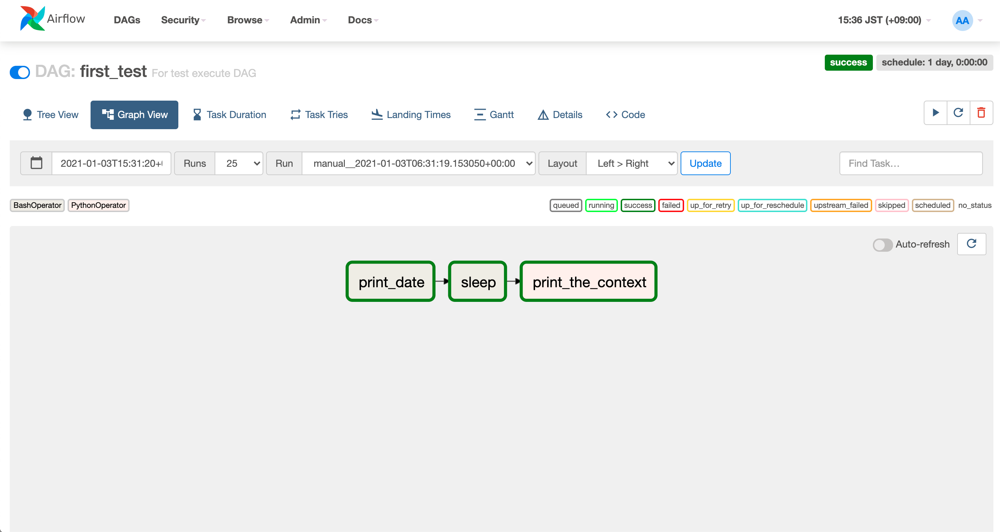
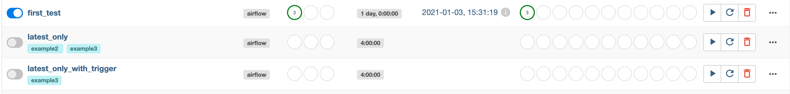

# Add DAG

## Goal

自身で定義したAirflow DAGを実行できるようにする。




## DAGファイルの作成

`./airflow/dags/firstDAG.py`  

### DAG定義

DAGそのものの定義は下記、 今回は過去の処理まで行う必要がないので、`catchup=False`に設定。

- default_args
  - start_date: ワークフローの開始日。過去に設定していた場合、`schedule_interval`の間隔で開始日から現在の時間までの処理をまとめて行う。
- DAG
  - catchup: `start_date`を過去に設定していた場合の過去のスケジュール分の処理を行うかどうかの設定

```py
default_args = {
    'owner': 'airflow',
    'depends_on_past': False,
    'start_date': days_ago(2)
}

dag = DAG(
    'first_test',
    default_args=default_args,
    description="For test execute DAG",
    schedule_interval=timedelta(days=1),
    catchup=False
)
```

### 処理の実装
1. Bashで、dateコマンドの実行
2. Bashで、sleep 5秒の実行
3. Pythonで、ワークフローのプロパティを表示し、「Hello! Airflow!!」を返却する `print_context`を実行

のフローを以下で実装。

```py
t1 = BashOperator(
    task_id='print_date',
    bash_command='date',
    dag=dag
)

t2 = BashOperator(
    task_id='sleep',
    depends_on_past=False,
    bash_command='sleep 5',
    retries=3,
    dag=dag
)

def print_context(ds, **kwargs):
    pprint(kwargs)
    print(ds)
    return 'Hello! Airflow!!!'

run_this = PythonOperator(
    task_id='print_the_context',
    provide_context=True,
    python_callable=print_context,
    dag=dag
)

t1 >> t2 >> run_this
```

## Airflowに読み込ませる

`airflow.cfg`の

**L.4**

```conf
dag_folder = /usr/local/airflow/dags
```
でにDAGのPythonファイルを配置するように設定されている。

今回は、`docker-compose.yml`の webserver / scheduler 共に、

```yml
volumes:
    - ./airflow:/usr/local/airflow
```
で、マウントしてあるので、本ディレクトリ内の `airflow/dags/` 内に格納すればAirflowがファイルを参照することになる。


### Intervalの設定
AirflowのSchedularが一定間隔で各DAGファイルの更新を確認しているため、 確認用に少し短くする。  

`airflow.cfg`の
**L.791**

```conf
dag_dir_list_interval = 20
```

を変更し、20秒間隔でDAGファイルの更新を確認するように設定する。


## 動作確認

http://localhost:8080/home
に、`first_test`のDAGが追加されているのを確認して、



実行確認できたらOK!


